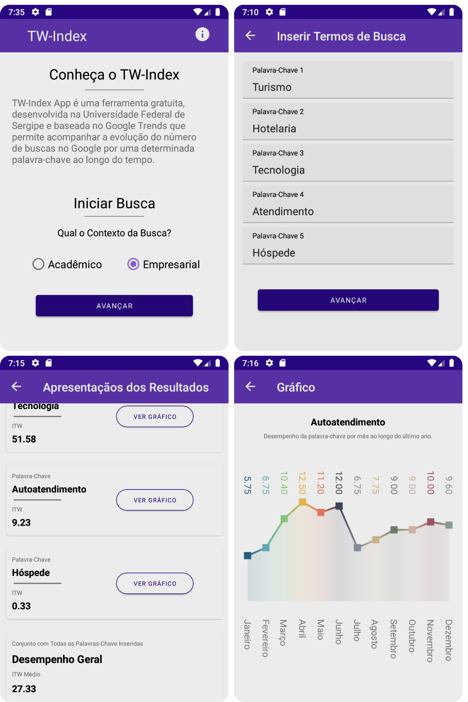

# TW-Index

O **TW-Index** é uma ferramenta de prospecção tecnológica baseada na técnica de Technology Watch.  
O objetivo é antecipar tendências, identificar oportunidades e mapear possíveis ameaças em tecnologias emergentes.

A aplicação permite monitorar o interesse por palavras-chave relacionadas a uma tecnologia ou pesquisa, realizando consultas customizadas ao Google Trends™ para coletar dados de volume de buscas por região e período.  
Esses dados são processados para gerar o **Índice ITW**, uma métrica normalizada de 0 a 100 que representa o interesse relativo por determinado termo. 

---

<p align="center">
  
</p>

---

## Objetivo

Apoiar decisões estratégicas por meio de indicadores reais de interesse tecnológico, aplicáveis a contextos acadêmicos e empresariais.


## Funcionalidades

- Consulta de até 5 termos por pesquisa  
- Filtro por região e período  
- Cálculo do Índice ITW (0 a 100)  
- Visão geral de desempenho  
- Gráficos de evolução mensal por termo  
- Modo acadêmico e empresarial  
- Aplicação multiplataforma


## ⚠️ Observação

Este repositório contempla apenas a aplicação mobile. O backend, por motivos de confidencialidade, não está disponível publicamente. Para conhecimento, foi utilizada a biblioteca [PyTrends](https://pypi.org/project/pytrends/) para integração ao Google Trends™. 

## Contexto e Validação

A primeira versão web do TW-Index foi desenvolvida por [Aragão (2019)](https://ri.ufs.br/handle/riufs/12303).

Para validar a ferramenta, [Moreno et al. (2020)](https://dl.acm.org/doi/pdf/10.1145/3401895.3402061) apresentam um estudo de caso com patentes da Universidade Federal de Sergipe (UFS), depositadas entre 1998 e 2014.

Em 2020, durante o Programa Institucional de Bolsas de Iniciação em Desenvolvimento Tecnológico e Inovação (PIBITI) foi desenvolvimento este projeto.


## Tecnologias Utilizadas

- .NET MAUI  
- C#  
- MVVM  
- CI/CD com Fastlane e Github Actions


## Pipeline de CI/CD

O projeto possui processo de CI/CD totalmente automatizado:

- Build automático a cada push e pull request  
- Execução de testes automatizados  
- Geração de artefatos de build  
- Assinatura e empacotamento do APK  
- Distribuição interna automatizada  

O pipeline é orquestrado pelo Github Actions e utiliza o Fastlane para automação de build e entrega mobile.

## 🚀 Como rodar o projeto

## 1️⃣ Clonar o repositório

```bash
git clone https://github.com/seu-usuario/tw-index.git
cd tw-index
```

## 2️⃣ Abrir no Visual Studio

Abra o arquivo de solução:

```bash
TWIndex.sln
```

## 3️⃣ Restaurar as dependências

```bash
dotnet restore
```

## 4️⃣ Selecionar a plataforma

No Visual Studio, selecione a plataforma:

```
Android Emulator
```

## 5️⃣ Executar o projeto

```bash
dotnet build
dotnet run
```

## Licença

Este projeto é distribuído sob a licença MIT.
Consulte o arquivo LICENSE para mais detalhes.


